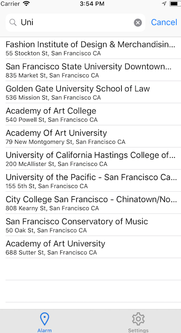

# Arrive-Awake
Location based alarm for iOS

## Why?
On my last internship, I took a 40~ minute train to work every morning. On most days, the peaceful early morning train ride would lull me into a sleepy state such that I wanted to nod off and take a quick power nap. However, I was always too afraid of not waking up in time for my stop. Subsequently, I needed a tool to wake me up when I arrived at my stop. I could not use a conventional alarm to wake me up after a set amount of time as the duration of each ride varied from trip to trip. I decided that I needed a location-based alarm and deemed this the perfect oppourtunity to learn how to create iOS apps, a skill I have wanted to learn for a while.

## How does it Work?

When you run the application, you will be asked to permit the app to use your location. Following this, you will be directed to a map that will show you your current location. Above that will be a search bar where you will enter the location you would like to be reminded at.

As you enter letters into the search bar, a table will appear which will automatically populate with locations.

Once you search and select your location, the location will be shown to you on the map. A red circle will also appear around the location. This red circle represents the area in which you would like to be notified. 

You can modifiy the radius of this circle by sliding the slider left and right. The map will dynamically zoom based on the radius of the circle to keep the map readable.

    

## Current Progress and Next Steps
Currently the functionality to alert the individual in their desired region has not been implemented yet. Once done, possible next steps would be to:

  1) Create favourite locations folder
  2) Customizable alarms (eg. Specific song from device)
  3) Expand app to trigger alarm when user leaves a location and display a specific message like, "Pick up milk on your way home"
  3) Improve design of app to better accomadate different phones as well as people with disabilities 
  4) Have a screen show how far the user is from the location
  
